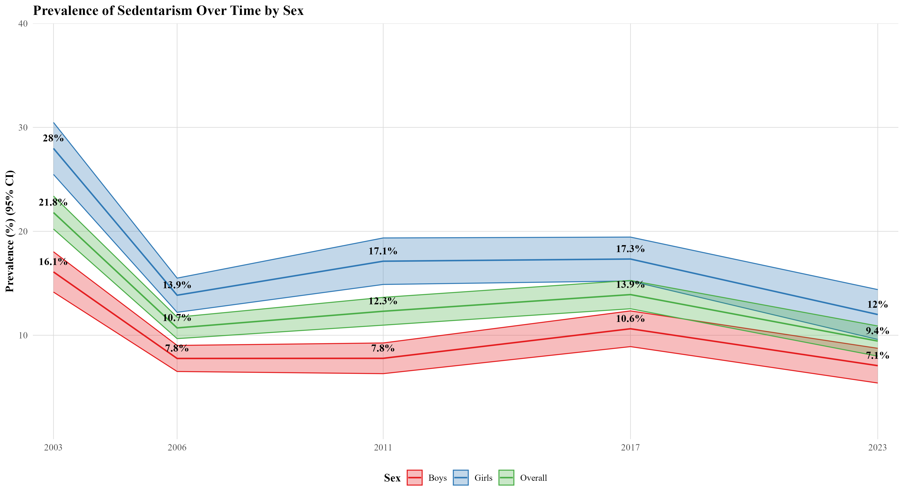
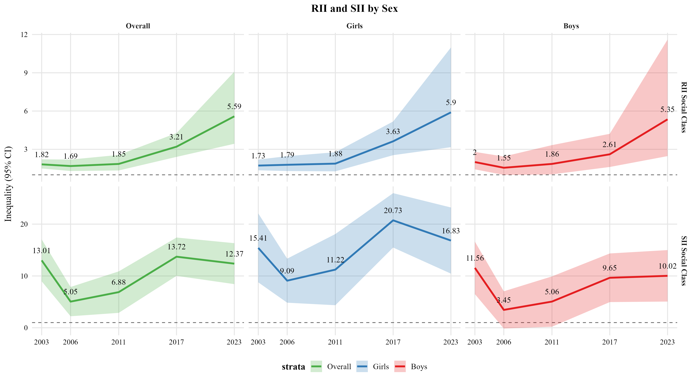
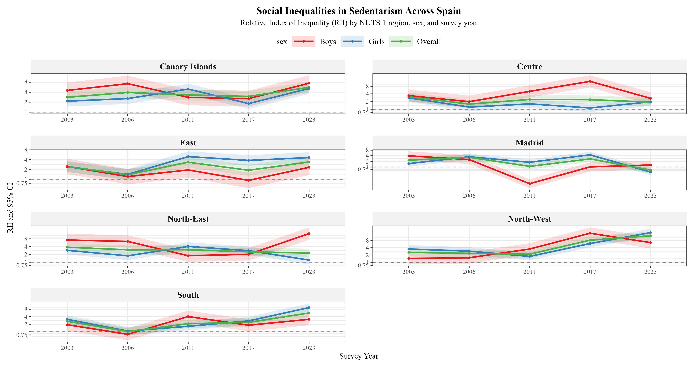
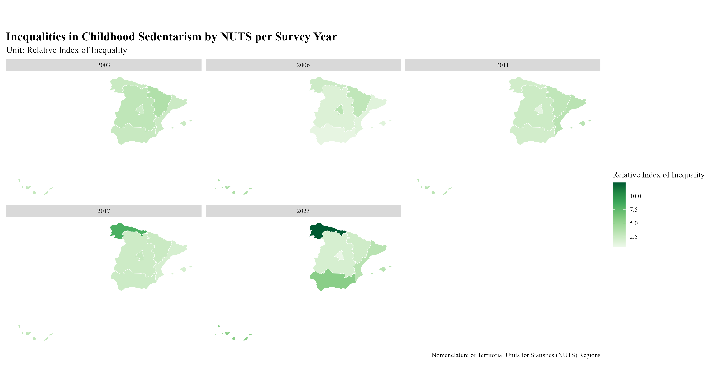
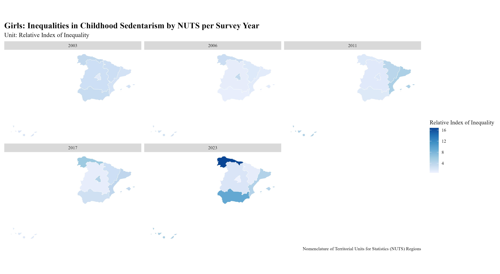
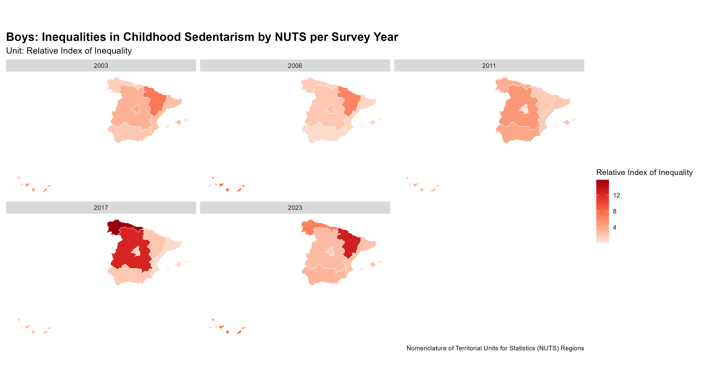

```{r setup, include=FALSE}
knitr::opts_chunk$set(echo = TRUE)
```

## Aim: 

Examine trends in socioeconomic inequalities in leisure-time sedentarism
among children aged 6 to 12 years in Spain between 2003 and 2023.

## Methods:

***Data source:*** Five cycles (2003, 2006, 2011, 2017, 2019) of the
Spanish National Health Survey. Final study population of 19,500.

***Exposure:*** The continous socioeconomic rank variable derived from
occupational social class of the household reference person.

***Outcome:*** Children reported as engaging in any physical activity
regardless of frequency were classified as non-sedentary, and those
reported as performing none as sedentary.

***Statistical Analysis:*** Quantification of socioeconomic inequalities
in childhood sedentarism:

-   Poisson regression models with log link and robust standard errors,
    adjusting for age and sex, incorporating survey weights,
    representing the Relative Index of Inequality - RII, interpreted as
    the prevalence ratio of sedentarism between the lowest and highest
    socioeconomic positions.

-   Poisson regression models with identity link, adjusting for age and
    sex, incorporating survey weights, representing the Slope Index of
    Inequality - SII, interpreted as the absolute difference in
    predicted sedentarism prevalence, in percentage points, between the
    lowest and highest socioeconomic positions.

-   Multi-level Poisson regression models with a log link were fitted
    including all survey years, adjusting for age and sex and
    incorporating survey weights. Individuals were nested within survey
    years and NUTS regions. Random intercepts and random slopes for
    social class were specified at the survey and region levels,
    allowing baseline sedentarism and socioeconomic inequalities to vary
    across time and regions.

-   Regional clustering was assessed by estimating intraclass
    correlation coefficients (ICCs) from multilevel Poisson regression
    models with a log link including random intercepts and slopes for
    social class.

-   The annual percent change in sedentarism inequality overall and
    separately for each NUTS region from 2003 to 2023 was calculated,
    where positive APC indicate increasing RII over time.

-   The inflection point in the temporal trend of sedentarism inequality
    between 2003 and 2023 was identifed using segmented regression.

***NUTS regions classification:***

-   The Canary Islands; Centre: Castile and Leon, Castilla-La Mancha,
    and Extremadura; East: Catalonia, the Valencian Community, and the
    Balearic Islands; Madrid: the Community of Madrid; North-East: the
    Basque Country, Navarre, La Rioja, and Aragon; North-West: Galicia,
    Asturias, and Cantabria; and South: Andalusia, Murcia, and the
    autonomous cities of Ceuta and Melilla.

## Results:

#### Descriptive sample characteristics: 

The sex, municipality type, and region distribution remained stable
across survey years. Boys represented approximately half of the sample
each year. Municipality type remained relatively consistent across
survey years, with approximately half of the children living in urban
municipalities, followed by semi-urban and rural areas. The regional
distribution was also stable, with the East and South regions
representing the largest proportions across all years. The age,
nationality and occupational social class distributions varied across
survey years. Children aged 6 to 9 years represented the largest
proportion in most years. The proportion of children with foreign
nationality increased steadily over time. Occupational social class
distributions shifted over time, with an increase in the proportion of
children from lower occupational social classes, particularly Class V.

#### Sedentarism prevalence across survey years: 

```{r fig.cap="Prevalence of Sedentarism 2003-2023 by Sex", echo=FALSE, out.width="100%"}

```

Overall decrease, 21.8% (95% CI: 20.2, 23.4) in 2003 to 9.4% (95% CI:
8.0, 10.9) in 2023. Among girls, 12.0% (95% CI: 9.6, 14.4) and boys,
7.1% (95% CI: 5.4, 8.7) in 2023. Among the lowest socioeconomic
position, 20.4% (95% CI: 14.8%, 26.0%), and among the highest, 5.8% (95%
CI: 2.6, 9.0) in 2023.

#### Inequalities in sedentarism across survey years:

```{r fig.cap="RII and SII overall and by sex", echo=FALSE, out.width="100%"}

```

RII rose from 1.82 (95% CI: 1.50, 2.22) in 2003 to 5.59 (95% CI: 3.42,
9.08) in 2023, indicating that children in the lowest social class had
more than five times the prevalence of sedentarism compared to those in
the highest. In 2023, inequalities were slightly greater among girls at
5.90 (95% CI: 2.47, 11.50) than boys at 5.35 (95% CI: 3.17, 10.99).

SII, the predicted prevalence of sedentarism, was 13.01 (95% CI: 8.97,
17.05) percentage points higher among children in the lowest social
class compared to the highest in 2003 and remained similar in
2023 at 12.37 (95% CI: 8.42, 16.33). Among girls, this absolute
inequality reached 16.83 (95% CI: 10.45, 23.21) percentage points in
2023 and peaked at 20.73 (95% CI: 15.48, 25.98) percentage points in
2017.

#### Inequalities in sedentarism across survey years and NUTS regions:

```{r fig.cap="Overall: RII by NUTS per Survey Year", echo=FALSE, out.width="100%"}

```

In 2003, inequalities were present across all regions, with the highest
observed in the North-East at 3.79 (95% CI: 2.58, 5.58), indicating
substantially higher prevalence among children in the lowest social
class compared to the highest. In contrast, Madrid experienced a marked
decline in inequality over time, with the RII decreasing from 2.33 (95%
CI: 1.58, 3.43) in 2003 to 0.69 (95% CI: 0.47, 1.02) in 2023, suggesting
a reversal of the socioeconomic gradient. The North-West showed the
greatest inequality overall, reaching an RII of 12.48 (95% CI: 8.49,
18.36) in 2023. Inequalities also increased over time in the Canary
Islands at 5.58 (95% CI: 3.79, 8.20) and South regions at 5.65 (95% CI:
3.84, 8.31) percentage points.

```{r fig.cap="Overall: RII by NUTS per Survey Year", echo=FALSE, out.width="100%"}

```

```{r fig.cap="Girls: RII by NUTS per Survey Year", echo=FALSE, out.width="100%"}

```

Among girls, relative inequalities in sedentarism were present across
all NUTS regions in 2003 and increased in several regions over time. The
largest increase was observed in the North-West, where the RII reached
16.79 (95% CI: 11.58, 24.35) in 2023, followed by the South at 9.28 (95%
CI: 6.40, 13.45), indicating substantially higher prevalence among girls
in the lowest social class compared to the
highest.

```{r fig.cap="Boys: RII by NUTS per Survey Year", echo=FALSE, out.width="100%"}

```

Among boys, inequalities varied more markedly across regions and survey
years. In 2003, the highest inequality was observed in the North-East at
7.21 (95% CI: 4.16, 12.50). Inequalities increased sharply
in the Centre and North-West in 2017 with 12.48 (95% CI: 7.20, 21.64)
and 15.85 (95% CI: 9.14, 27.48) percentage points, respectively, before
declining in 2023. In contrast, the North-East showed a substantial
increase by 2023, reaching 12.80 (95% CI: 7.38, 22.19).

ICCs could not be reliably estimated for models including random slopes
for social class due to singularity issues. Using random-intercept
models only, ICC values ranged from approximately 1% to 5%, indicating
minimal regional clustering in sedentarism.

#### Annual Percent Change and Inflection Point:

National: From 2003 to 2023, the annual percent change in relative
socioeconomic inequalities of sedentarism at the national level was
5.36% (95% CI: 2.57, 8.22). Among girls, the increase was slightly
higher at 5.92% (95% CI: 2.39, 9.56), and among boys slightly lower at
4.64% (95% CI: 1.12, 8.29).

NUTS: Relative inequalities decreased in the North-East (-2.47, 95% CI:
-3.12, -1.81) but increased substantially in the North-West (9.33, 95%
CI: 4.85, 13.99). Among girls, inequalities increased over time
in the Canary Islands (4.21, 95% CI: 2.33, 6.13) and East regions (3.34,
95% CI: 3.14, 3.54). While among boys, inequalities increased primarily
in the North-West (9.57, 95% CI: 2.90. 16.68).

The segmented regression identified an approximate inflection point
around 2014, situated between 2011 and 2017 survey years. Prior to this
year, the slope of the trend in RII was -0.009 per year, indicating a
relatively stable or slightly decreasing inequalities. After this point,
the slope increased sharply (0.36 per year).
